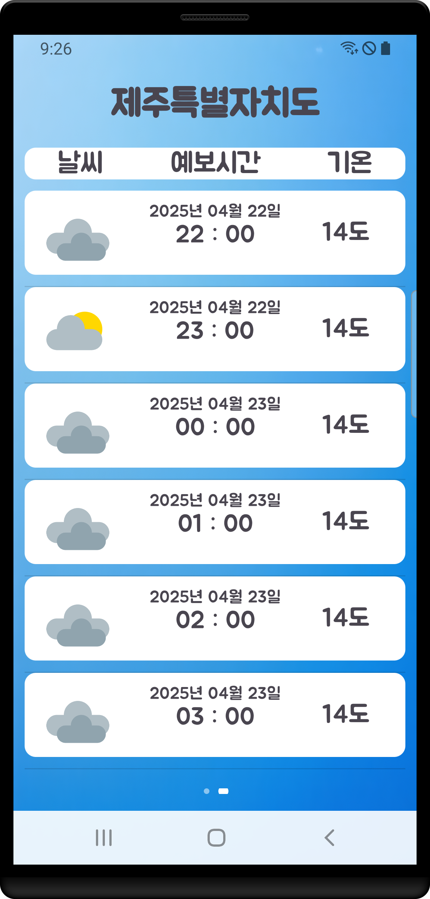

# 날씨 앱 (Weather App)
**날씨 앱**은 공공 데이터 포털의 기상청_단기예보 ((구)_동네예보) 조회서비스 API를 사용하여 사용자가 입력한 지역에 대한 **실시간 날씨 정보**를 제공합니다. 앱은 **온도**, **습도**, **강수량** 등의 정보를 보여주며, 날씨 데이터를 직관적으로 확인할 수 있습니다.

## 설명

이 앱은 **기상청 API**를 통해 제공되는 데이터를 사용하여 사용자가 지정한 지역의 날씨 정보를 실시간으로 가져옵니다. 사용자는 현재 날씨뿐만 아니라, 다양한 날씨 정보들을 확인할 수 있습니다. 직관적인 인터페이스로 사용자에게 제공됩니다.

## 기능

- **현재 날씨** 제공
- **온도**, **습도**, **강수량** 등 다양한 날씨 데이터 확인
- **지역 선택**: 사용자 지정 지역에 대한 날씨 정보 제공
- 날씨 정보 자동 갱신 기능 제공

## 기술 스택

- **언어 (Languages)**: Java, XML
- **도구 (Tools)**: Android Studio
- **라이브러리 (Libraries)**: Retrofit, Gson, OkHttp
- **기술 적용**:
  - **Retrofit**: 기상청 API와의 통신을 위한 네트워크 라이브러리
  - **Gson**: JSON 응답을 Java 객체로 변환하여 처리
  - **RecyclerView**: 유연하고 효율적인 리스트 구현
  - **ViewPager2**: 시간별 날씨 데이터를 스와이프하여 확인할 수 있도록 구현   

## 개발 중 겪은 문제와 그 해결 과정
앱을 개발하던 중, 공공데이터 포털에서 제공하는 API 키를 사용하여 API 요청을 보낼 때 문제가 발생했습니다.  날씨 데이터를 불러오지 못하고, API 요청이 제대로 처리되지 않는 상황이 계속되었습니다.

문제를 추적한 결과, **API 요청 시 인코딩된 API 키가 Retrofit을 통해 URL 쿼리 파라미터로 포함될 때 다시 인코딩되면서 실제 API 서버에서 처리되는 키 값이 달라졌다**는 사실을 발견했습니다. 이를 해결하기 위해 디코딩된 API 키를 직접 사용하여 API 요청을 보내는 방식으로 수정한 후, 정상적으로 데이터를 받아올 수 있었습니다.

이 과정을 통해 API 키와 관련된 인코딩/디코딩 처리 방식에 대한 이해도를 높일 수 있었고, 문제를 해결할 수 있었습니다.    

## 업데이트 25.2.20
- 현재시간으로 부터 6시간 후 까지의 날씨 정보를 표시하는 기능을 추가했습니다.
    - ViewPager2를 활용하여 시간별 날씨 데이터를 보여줍니다.
    - API에서 받은 데이터를 기반으로 동적으로 업데이트됩니다.   

##  업데이트를 위한 리팩토링 과정에서의 어려움
1. **초기 코드 설계 부족으로 인한 분석 어려움**
   - 원래는 **FO4-Helper** 프로젝트를 진행하기 전에 **Retrofit2 연습**을 위해 가볍게 시작한 프로젝트였음.
   - 처음에는 확장성을 고려하지 않고 기능 구현에 집중하다 보니, 나중에 코드를 다시 분석하고 수정하는 과정이 어려웠음.

2. **API 응답 처리 및 데이터 구조 변경**
   - 기존에는 현재 날씨만 처리하는 구조였지만, **ViewPager를 추가하면서 시간별 데이터를 리스트 형태로 다룰 필요**가 생김.
   - 이를 위해 **API 응답 모델을 수정**하고, **RecyclerView Adapter와 연계하는 과정**에서 데이터 흐름을 다시 정리해야 했음.
   
3. **비동기 처리 문제**  
   - **초단기실황조회와 초단기예보조회** 두 가지 API 요청을 동시에 보내야 했음.  
   - Retrofit의 비동기적 특성상 두 요청이 **언제 완료될지 예측할 수 없어**, 두 응답을 모두 받은 후 UI를 업데이트하는 과정이 어려웠음.  
   - 이를 해결하기 위해 **Callback 함수**를 활용하여 두 요청의 완료 시점을 동기화하는 작업이 필요했음.   
  

  

  
## Screenshots

### Home Screen

- 앱 실행 시 보이는 **홈 화면**입니다.
- 사용자가 원하는 지역을 입력하면 해당 지역의 날씨 정보를 확인할 수 있습니다.

### Weather Details

- 각 지역에 대한 **세부 날씨 정보**를 확인할 수 있는 화면입니다.
- **온도**, **습도**, **강수량** 등의 세부 데이터를 제공합니다.

- 현재 시간으로 부터 **6시간 후** 까지의 **날씨정보를 확인 할 수 있습니다.

## 실행 화면

