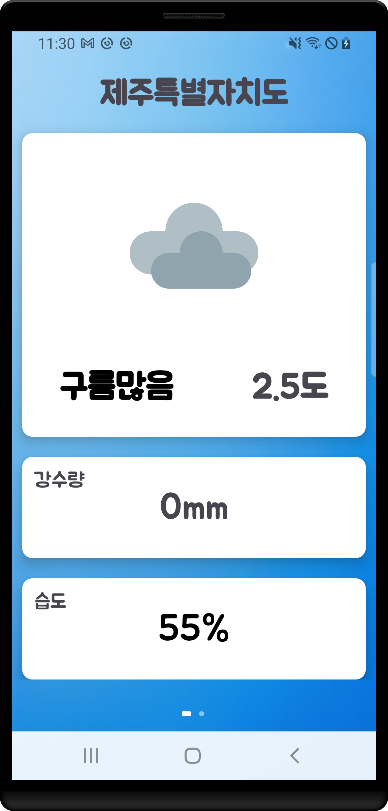

# 날씨 앱 (Weather App)

**날씨 앱**은 <a href="https://www.data.go.kr/tcs/dss/selectApiDataDetailView.do?publicDataPk=15084084">공공 데이터 포털의 기상청_단기예보 ((구)_동네예보)</a> 조회서비스 API를 사용하여 사용자가 입력한 지역에 대한 **실시간 날씨 정보**를 제공합니다. 앱은 **온도**, **습도**, **강수량** 등의 정보를 보여주며, 날씨 데이터를 직관적으로 확인할 수 있습니다.

## 설명

이 앱은 **기상청 API**를 통해 제공되는 데이터를 사용하여 사용자가 지정한 지역의 날씨 정보를 실시간으로 가져옵니다. 사용자는 현재 날씨뿐만 아니라, 다양한 날씨 정보들을 확인할 수 있습니다. 직관적인 인터페이스로 사용자에게 제공됩니다.

## 기능

- **현재 날씨** 및 **날씨 예보** 제공
- **온도**, **습도**, **강수량** 등 다양한 날씨 데이터 확인
- **지역 선택**: 사용자 지정 지역에 대한 날씨 정보 제공
- 날씨 정보 자동 갱신 기능 제공

## 기술 스택

- **언어 (Languages)**: Java, XML
- **도구 (Tools)**: Android Studio
- **라이브러리 (Libraries)**: Retrofit, Gson, OkHttp
- **기술 적용**:
  - **Retrofit**: 기상청 API와의 통신을 위한 네트워크 라이브러리
  - **Gson**: JSON 응답을 Java 객체로 변환하여 처리

 
## 개발 중 겪은 문제와 그 해결 과정
앱을 개발하던 중, 공공데이터 포털에서 제공하는 API 키를 사용하여 API 요청을 보낼 때 문제가 발생했습니다. 처음에는 날씨 데이터를 불러오지 못하고, API 요청이 제대로 처리되지 않는 상황이 계속되었습니다.

문제를 추적한 결과, **API 요청 시 인코딩된 API 키가 Retrofit을 통해 URL 쿼리 파라미터로 포함될 때 다시 인코딩되면서 실제 API 서버에서 처리되는 키 값이 달라졌다**는 사실을 발견했습니다. 이를 해결하기 위해 디코딩된 API 키를 직접 사용하여 API 요청을 보내는 방식으로 수정한 후, 정상적으로 데이터를 받아올 수 있었습니다.

이 과정을 통해 API 키와 관련된 인코딩/디코딩 처리 방식에 대한 이해도를 높일 수 있었고, 문제를 해결할 수 있었습니다.

## Screenshots

### Home Screen

- 앱 실행 시 보이는 **홈 화면**입니다.
- 사용자가 원하는 지역을 입력하면 해당 지역의 날씨 정보를 확인할 수 있습니다.

### Weather Details

- 각 지역에 대한 **세부 날씨 정보**를 확인할 수 있는 화면입니다.
- **온도**, **습도**, **강수량** 등의 세부 데이터를 제공합니다.

## 실행 화면

